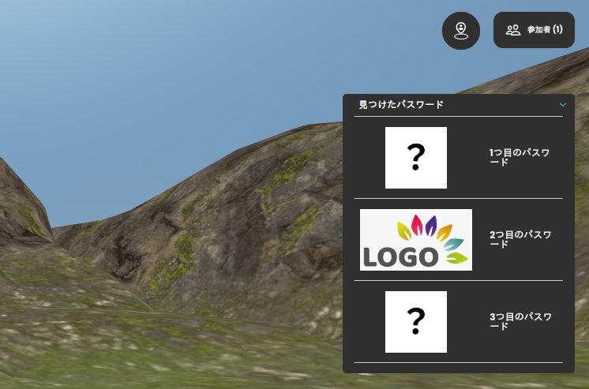

# password-collection-modal

A simple password collection modal.

- screenshot



## What is this?

password-collection-modal is a metatell plugin that provides a simple password collection modal.
This plugin is useful when you provide treasure hunt style game to your users.

password-collection-modal is implemented as a `CustomOverlay` plugin.

## How to use

1. Upload the plugin from metatell-admin.
2. apply the plugin to specific room.
3. setting the JS Call Event from Spoke.

Spoke has Active Trigger and Passive Trigger.
Both triggers can be used to call the JS Call Event.
JS Call Event Element has two parameters, `event` and `detail`.

For password-collection-modal, you can use the following settings.

- event: `find-password`
- detail:

```
{
   "index": 0
   "image_url": "https://example.com/image.png",
}
```

Index should be a number (0-2), and `image_url` should be a URL of the image.

If you want to show image modal when the user finds the password, you can use `2D View` trigger.

## More customization

You can customize the modal by changing plugin code.
The plugin code is written in TypeScript, so you can easily change the behavior of the modal.

Plugin template repository may be useful to start developing your own plugin.

- https://github.com/urth-inc/metatell_plugin_template/tree/develop/CustomOverlay

